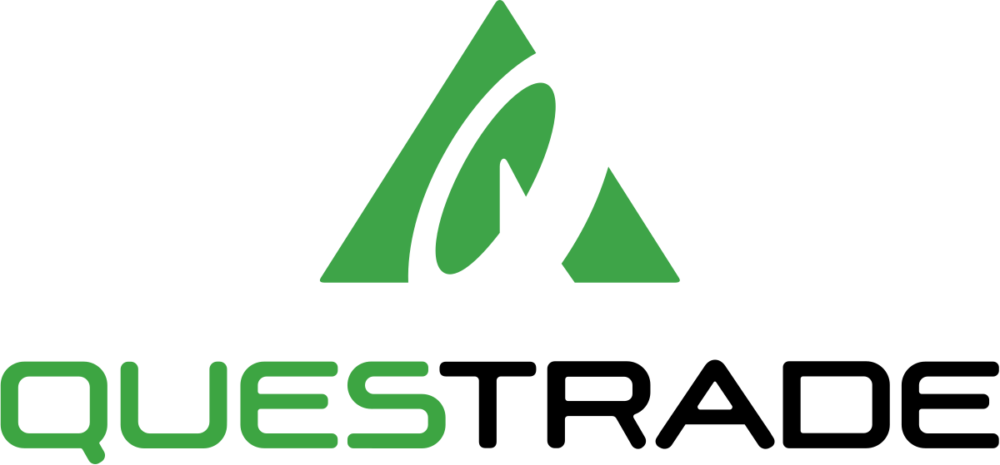

# Questrade, a Great FinTech Company

## What is the background of your company? What do they do? Who are their competitors?

Questrade was launched in 1999 by Edward Kholodenko with the help of three partners. As Canada's largest discount broker, Questrade competes  against other stock brokers  the business of both individual and professional investors/market participants. Questrade charges investors a fee for executing the investors stock order on a stock exchange. Typically, discount brokers differentiate themselves from the competition by competitively pricing their services. In order to undercut the competition and remain profitable, discount brokers may not offer the full range of services that are available at larger financial institutions or brokerages. 

## How does this company use technology to their advantage? Why are they considered a FinTech company?
Questrade has clearly targeted young, inexperienced investors. It has low fees, mobile-first development,ease of use and a highly customizable user experience including an automated portfolio builder. The platform goes beyond merely stock trading. It also includes access to tutorials, goal trackers, investment tools, etc. 

Questrade has a revenue generation strategy typical of a fintech company, earning money from trading fees, subscription fees, management fees, and administration fees. The Questrade platform facilitates electronic stock trading and cuts out the middleman. Trade execution and payment are carried out entirely through the platform. 

## Why is this company exemplary in the FinTech space? What are their strengths and weaknesses? 

Questrade is considered an exemplary in the FinTech industry as aninvestment management company. Questrades provides a user-friendly interface, low-rate fees, innovative products and guarantees transparency as strengths. While there weaknesses are limited product offering, customer service and research resources.

### Strengths:

1.Low Fees: Questrade offers lower fees than traditional brokerages. This fees consist of low trading fees and no account fees.
2.User-Friendly Interface: Questrade's interface has a clean design and is easy to navigation. User can further customize the interface to fit their needs.
3.Innovation: Questrade is inventing and releasing new products like their robo-advisor service and Questwealth.
4.Transparency: Questrade guarantees transparency about the fees, security measures, and investment options.

### Weaknesses:

1.Limited Product Offerings: While Questrade offers a wide range of  investment options , which including stocks and mutual funds. They fail to provide options or futures.
2.Customer Service: Customers are having difficulties with long wait times and getting issues resolved.
3.Limited Research and Educational Resources: While Questrade does offer some research and educational resources, they are not extensive enough to make investment decisions.

## What is the prognosis for this company? Where do they expect to be in the future?

### Contributors
Eric Lamoureux, Larry Gagnon, Athura Thavathasan, Ramchandran, Karthika
