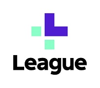

# Module 1 Challenge - Gagnon (Due Feb 27)
 
## League, Inc., A Canadian FinTech Company Revolutionizing the Healthcare Industry

### Background
League, Inc., (www.league.com) was founded June 4, 2014 and incorporated June 12, 2014 by founders Michael Serbinis (www.linkedin.com/in/mserbinis/), Dan Leibu and Dan Galperin. Dan Leibu (https://www.linkedin.com/in/danielleibu/) is the Chief Product & People Officer of League. Dan had previously served as the CTO at Kobo. Dan Galperin (https://www.linkedin.com/in/dangalperin/) presently serves as the CTO for League. All three operate out of the Toronto, Ontario area.

### Funding 
League was funded by a total of 19 investors, with 4 investors (TDM, OMERS, Workday, Telus) currently serving as leads. 
At the end of 2021 the pre-money valuation of the financing priced League at $850 million USD, or $1.1 billion CAD, making it Canada’s newest tech unicorn. Disclosed funding rounds were as follows:
* Nov 12, 2014 - Received seed funding ($4M) from OMERS Ventures
* Jun 14, 2016 - Received Series A funding ($25M) from OMERS Ventures
* Jul 24, 2018 - Received Series B funding ($62M) from Telus Ventures
* Oct 29, 2019 - Received Corporate Round funding (unannounced) from Workday Ventures
* Dec 31, 2021 - Recevied Received Series C funding ($95M) from TDM Growth Partners\
Total funding received as of January 2, 2022 is $205M. [^1] 

## Business Activities

### Company Mission,  What specific financial problem is the company or project trying to solve?
The League platform was created to improve the consumer experience in Healthcare. Their single platform user experience overcomes issues with legacy technologies and disparate systems. 

* Who is the company's intended customer?  Is there any information about the market size of this set of customers?\

The company has targeted the Healthcare consumer, the provider, and the payer. They are brought together in this single platform.
As of 2022 the annual Healthcare claims market in Canada across 130 Healthcare insurers was about USD 110 billion. This is a large industry tha thas evolved slowly over th elast 50 years,failing ot keep up withmodern comminucaiotns methods and electronic security standards. To create a lightweight full function tool that supports the healthcare industry is an enormous task, due largely to the complexities of regulatory compliance requirements from jurisdictions around the world. 

The development of a functional app for mobile devices is not the real challenge behind the delivery of this type of technology. Developing an app that includes the ability to demonstrate global data privacy and security compliance in all aspects of it function is, by far, the biggest and most costly challenge.

This is where League, one of the firs tout of the gate with this type of tehcnology, has a distinct advantageover the market. 
Once the platform is built and compliance reuiqrements integrate dinto the solution, it can be re-apacked a resold under various labels, at a cost that a competitor cannot match.
this is exactly the trens we are seeing with LEague, now. League has shifted focus form being a service platform, to be being a technology provider. Leagues platform has been licenced by several larg eentiries and rel packaged to fit their breand. League's goal is to provide backgorund ufnctionality labelled as "powered by League:". Thsi is attratcive to thos eocmpanies that wish to move forward and modernize their claims, provider, end user and payment technology. ther eis also the advantage of off-loaoding th erisk associate to non-compliance. By using th eLEague technology, the proviver effecitvely offloading compliance risks to League, therby cutting annual maintenance costs.

* What solution does this company offer that their competitors do not or cannot offer? (What is the unfair advantage they utilise?)
* 
This company was early to market with a clean, simplified, always available user experience, which is also available as an app on mobile devices. Being early to market allowed them to obtain funding from key players in this space, such as Telus.

* Which technologies are they currently using, and how are they implementing them? (This may take a little bit of sleuthing–– you may want to search the company’s engineering blog or use sites like StackShare to find this information.)\
The technologies used by League are as follows:
Application and Data
Javascript
JQuery
React
NGINX
PostgreSQL
MongoDB
Google Drive
GraphQL
Swift 
Google Compute Engine
Objective C
Utilities
PayPal
Google Maps
Google Analytics
DevOps
GitHub
Git
Docker
npm
Jenkins
PyCharm
Android Studio
ESLint
Docker Compose
Grafana
CircleCl
Business tools include
Slack
Jira
GSuite
Salesforce

## Landscape

* What domain of the financial industry is the company in?\
The company is supporting Healthcare on the consumer, practicioner and insurance sides.

* What have been the major trends and innovations of this domain over the last 5–10 years?\[^2]
Healthcare has migrated from paper claim forms to a fully electronic environment. 
Along wiht claims management, payment ,management is also fully electornic. No more cheques in the mail. Payments are direct deposit.

* What are the other major companies in this domain?\
The major players in Canadian Healthcare are Manulife, Canadalife, Sunlife, Blue Cross and GMS.
Companies similar to League in the USA are Practo, Medisafe, and Meru Health.

## Results

* What has been the business impact of this company so far?\
From platform to Powered by League, capitalizing on PArtner relationships to expand.
By February 2020, League was offering its HBX to wealth management and benefits provider Canada Life‘s customers. Months later, the company announced its ‘Powered by League’ partner program to power digital health infrastructure for pharmacies, health systems, and financial institutions.[^3]
By the end of the year, League had partnered with Loblaw Companies to build the grocery giant’s new health-focused app, PC Health (Wittington Ventures is also notably the subsidiary of a holding company owned by the Weston family, which also owns and operates Loblaws). League also signed agreements in 2021 to build the health and benefits and benefits platform for Humana, the third-largest health insurance provider in the United States.

* What are some of the core metrics that companies in this domain use to measure success? How is your company performing, based on these metrics?\

* How is your company performing relative to competitors in the same domain?\

## Recommendations

* If you were to advise the company, what products or services would you suggest they offer? (This could be something that a competitor offers, or use your imagination!)\
The company should explore leveraging their app as a marketing platform for Products and services related to Healthcare. 
Medcial aids indistry is worth XXXXX
Mental Health industry is XXXXXXXXX
Fitness XXXXXXX

Healthcare support services XXXXX
Delivering ads via the app is a great way to target users

* Why do you think that offering this product or service would benefit the company?\

* What technologies would this additional product or service utilise?\

* Why are these technologies appropriate for your solution?\

#Addendum
### References
[^1]: https://betakit.com/league-enters-2022-as-canadas-newest-unicorn-with-tdm-growth-partners-led-round/
[^2]: https://www.summitsearchconsultants.com/insurtech
[^3]: https://www.canadalife.com/about-us/news-highlights/news/canada-life-now-offering-leagues-health-benefits-experience-platform.html

